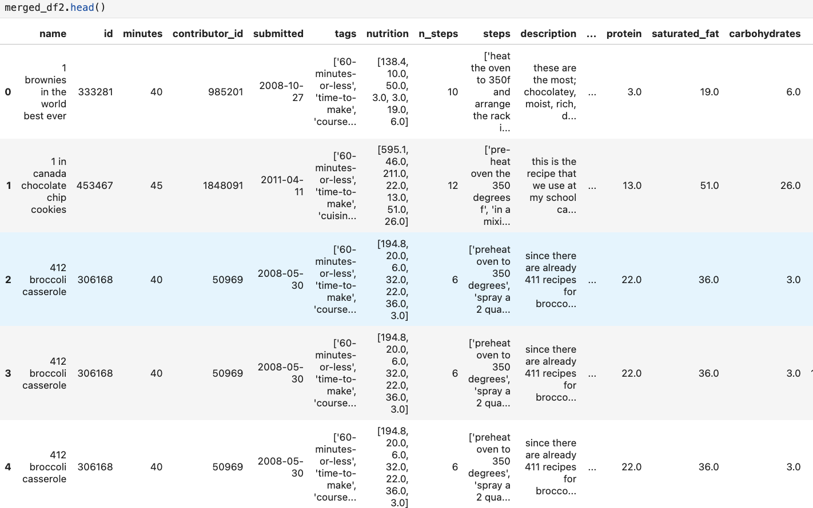
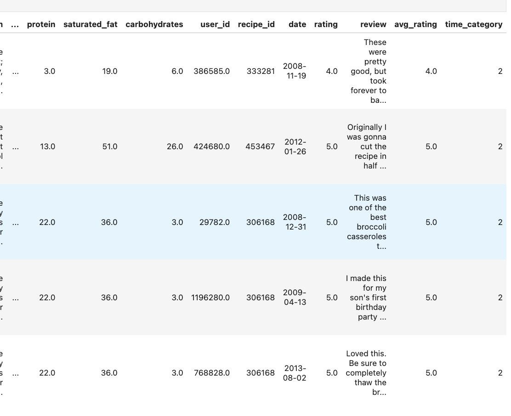
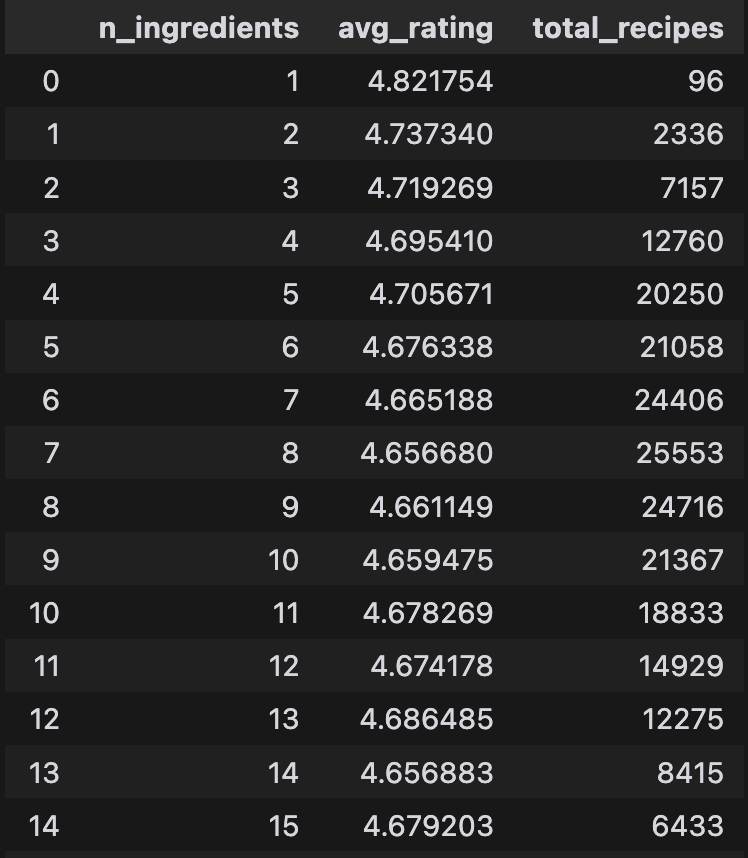

# RecipeProject

## Introduction
<!-- Add your project introduction here -->

The dataset used in this project consists of recipes and their associated user ratings, providing information for analyzing culinary preferences and trends. The primary focus of this project is to explore how various factors, such as ingredients and preparation time, influence the ratings of recipes. This analysis can help both home cooks and professionals understand what makes a recipe successful in terms of user satisfaction.

### Central Question

The central question of this project is: **How do the nutritional content and preparation time of recipes affect their average user ratings?**

### Importance of the Question

Understanding the relationship between recipe characteristics and user ratings is crucial for several reasons:

1. **Consumer Insight**: It helps consumers make informed choices about which recipes to try based on their preferences for healthiness and preparation time.
2. **Culinary Trends**: Identifying trends in user ratings can guide chefs and food bloggers in creating recipes that are more likely to be well-received.
3. **Nutritional Awareness**: As more people become health-conscious, knowing how nutritional factors influence ratings can encourage healthier cooking choices.

### Dataset Overview

- **Number of Rows**: The recipes dataset contains **83,782 rows** and the interactions dataset contains**731,927 rows**
  
### Relevant Columns

The following columns are particularly relevant to our central question:

1. **`calories`**: This column indicates the total caloric content of the recipe. It is essential for understanding how the energy content of a dish influences its popularity.
  
2. **`n_steps`**: This column represents the number of steps required to prepare the recipe. It provides insight into how preparation complexity may affect user ratings.
  
3. **`avg_rating`**: This column contains the average user rating for each recipe. It serves as the primary measure of user satisfaction and is the outcome variable in our analysis.

4. **`n_ingredients`**: This column indicates the number of ingredients used in the recipe. It can help assess whether simpler recipes with fewer ingredients tend to receive higher ratings.

By analyzing these columns, we aim to uncover patterns and insights that can inform both consumers and culinary creators about the factors that contribute to recipe success.

## Data Cleaning and Exploratory Data Analysis
<!-- Describe your data cleaning process and initial findings -->
Step 1: We fixed the recipes column by extracting data in "nutrition" column and giving each value its corresponding column. Here, we created individual columns in our dataset called 'calories', 'total_fat', 'sugar', 'sodium', 
'protein', 'saturated_fat', 'carbohydrates'. This makes the data formatted better and easier to read/understand.

Step 2: We also merged the two dataframes together on the recipe id, as this was the most logical column to merge on that appears in both datasets and serves as a unique identifier.

Step 3: We also replaced all the 0 ratings with np.nan. On top of that, we calculated the average rating across unique recipes and appended into our merged_df. The resulting Dataframe with avg ratings column is called merged_df.

head of the final cleaned dataframe:

### Rating Distribution Plot (Univariate Analysis)

Here is the distribution of individual ratings:
This demonstrates that most ratings are skewed higher in the 4, 5 range, with a significant amount of 5 star ratings. There are very few ratings that are in the 1-3 range. This means that ratings for recipes in this dataset are generally high.

<iframe
  src="assets/individual_ratings_distribution.html"
  width="800"
  height="600"
  frameborder="0"
></iframe>

### N_Ingredients vs Average Rating Plot (Bivariate Analysis)

<iframe
  src="assets/n_ingredient_avgrating.html"
  width="800"
  height="600"
  frameborder="0"
></iframe>

We wanted to see if there's a correlation between number of ingredients and the number of steps. However, from this scatter plot it's evident that there's no strong correlation. The number of ingredients doesn't seem to affect the number of steps. Regardless of the n_ingredients going up/down there's no pattern with the resulting n_steps.

### Intresting Aggregate Analysis

This shows interesting information about n_ingredients when grouped together. It shows the number of recipes that use a specific amount of ingredients and the average rating, which is very useful for data analysis when looking at n_ingredients as a variable.

## Assessment of Missingness
<!-- Detail your analysis of missing data -->
Potential NMAR column: 
In our dataset, the `rating` column could potentially be NMAR. Here is our reasoning:

- **User Behavior**: Users may choose not to rate a recipe based on their experience with it. For instance, if a user finds a recipe particularly unsatisfactory, they might opt not to leave a rating at all. Conversely, users who have had a positive experience may be more inclined to provide a rating. This behavior suggests that the missing ratings are not random but are influenced by the quality of the recipe as perceived by the user.

- **Addtional Data**: Other data we could collect to explain the missingness of rating could be other columns from the dataset. There could possibly be other columns that affect the missingness of rating. These include calories, carbohydrates, protein, and other variables of a recipe that could potentailly affect whether a user leaves a rating.

**First Step:** identify columns with missing values

There are a few columns that contain missing values. We will be analyzing the missingness of the "rating" column due to its non trivial missingness. We know the ratings logically cannot be Missing by Design because these are user reviews, and it's highly unlikely to be MCAR. We wanted to determine if a missing rating is NMAR or MAR on another column in the dataset.

We created a permutation test function that will work for any numerical column in the dataframe. We use this function to perform permutation test for missing rating values and other columns to calculate the p_value and determine if rating is MAR on another column, using a 0.05 significance value.

**One column that "Rating" is MAR on: Calories**

**One column that "Rating" is not MAR on: Carbohydrates**

Permutation Test to see if Rating is MAR on Carbohydrates

<iframe
  src="assets/perm1_MAR.html"
  width="800"
  height="600"
  frameborder="0"
></iframe>

Permutation Test to see if Rating is MAR on Calories
<iframe
  src="assets/perm2_MAR.html"
  width="800"
  height="600"
  frameborder="0"
></iframe>

## Hypothesis Testing
<!-- Explain your hypothesis tests and results -->
**Null Hypothesis:** There is no effect of Recipes with 1000+ Calories on recipe rating.

**Alternate Hypothesis:** Recipes with 1000 or more calories have a lower average rating

**Test Statistic:** Difference in mean rating between recipes with 1000+ calories and under 1000 calories 

Here is the average rating calculated of recipes that are >= 1000. True is recipes with 1000+ calories, False is recipes less than 1000 calories.

False:    4.681211
True:     4.655571

*(Mean of Rating of Recipes with 1000+ calories) - (Mean of Rating of Recipes under 1000 calories)*

**Clarity of Hypotheses**: The null hypothesis provides a clear assumption that there is no relationship between calorie content and recipe ratings. The alternate hypothesis directly addresses the question by positing a specific effect (lower ratings for higher-calorie, 1000+ recipes). 

 **Appropriate Measure**: The choice of the mean rating difference as the test statistic is appropriate because it provides a clear and interpretable measure of the effect size. It allows us to quantify the difference in user satisfaction between high-calorie and lower-calorie recipes.
<iframe
  src="assets/hypo_test.html"
  width="800"
  height="600"
  frameborder="0"
></iframe>

**Result:**

P Value: 0.0

Reject the Null Hypotheses

**Statistical Significance**: A p-value of 0.0 indicates that the observed difference in ratings is highly statistically significant. This strong evidence against the null hypothesis suggests that there could be an effect of calorie content on recipe ratings. It's unlikely that there's no relationship between high calorie recipes and ratings.

## Framing a Prediction Problem
### Prediction Problem Characteristics
- **Problem Type**: Multiclass Classification
- **Response Variable**: `time_category`

### Motivation
The goal is to predict recipe preparation time categories based on recipe characteristics known before cooking, helping users quickly identify recipes that match their time constraints.

### Classification Details
- **Classification Type**: Multiclass (3 categories)
- **Categories**: 
 1. Quick recipes
 2. Medium-length recipes
 3. Long recipes

### Feature Selection Rationale
Features selected are those known *before* cooking:
- Number of recipe steps
- Number of ingredients
- Nutritional information

### Model Evaluation Metric
- **Primary Metric**: Accuracy
- **Justification for Accuracy**:
 - Provides an overall view of model performance
 - Easily interpretable
 - Suitable for balanced datasets
 - Gives a straightforward measure of correct predictions across all categories

### Alternative Metrics Considered
- F1-Score (balances precision and recall)
- Confusion Matrix (provides detailed class-wise performance)

## Baseline Model
### Model Description

In this project, we developed a **Decision Tree Classifier** to predict the cooking time category of recipes based on their features. The model categorizes recipes into three distinct cooking time categories: **quick (≤15 minutes)**, **medium (16-30 minutes)**, and **long (>30 minutes)**. The Decision Tree algorithm was chosen for its interpretability and ability to handle both numerical and categorical data effectively.

### Features in the Model

The features used in the model are as follows:

1. **n_steps** (Quantitative): This feature represents the number of steps required to prepare the recipe. It is a continuous numerical variable.

2. **avg_rating** (Quantitative): This feature indicates the average rating of the recipe, which is also a continuous numerical variable.

The model does not include any ordinal or nominal features directly. However, the target variable, **time_category**, is categorical, representing the cooking time classification. 

### Encoding

Since the model only uses quantitative features, no additional encoding was necessary for the features. The target variable, **time_category**, is categorical and is used directly in the training process of the Decision Tree Classifier.

### Model Performance

The performance of the model was evaluated using accuracy metrics on both the training and testing datasets:

- **Training Accuracy**: 0.6575 (65.75%)
- **Testing Accuracy**: 0.5500 (55.00%)

The training accuracy indicates that the model performs reasonably well on the training data, correctly classifying approximately 65.75% of the samples. However, the testing accuracy of 55.00% suggests that the model struggles to generalize to unseen data, which is a common issue in machine learning known as overfitting.

### Evaluation of Model Quality

Based on the performance metrics, the current model can be considered **moderately effective** but not "good" due to the following reasons:

1. **Overfitting**: The significant difference between training and testing accuracy indicates that the model may have learned the training data too well, capturing noise rather than the underlying patterns. This is evident as the model performs much better on the training set compared to the testing set.

2. **Testing Accuracy**: A testing accuracy of 55.00% is relatively low, especially for a classification task. This suggests that the model may not be reliably predicting the cooking time categories for new, unseen recipes.

3. **Feature Selection**: The model currently only utilizes two features. While these features are relevant, incorporating additional features (such as ingredients, nutritional information, or user reviews) could potentially improve the model's performance.

### Conclusion

In summary, while the Decision Tree Classifier provides a foundational approach to predicting cooking time categories, its current performance indicates room for improvement. Future work should focus on enhancing feature selection, exploring more complex models, and addressing overfitting to achieve better generalization on unseen data.

## Final Model
### Features Added and Their Importance

In the final model, we included the following features:

1. **n_steps**: The number of steps required to prepare the recipe. This feature is crucial as it directly correlates with the complexity and time required for cooking. Recipes with more steps typically take longer to prepare.

2. **n_ingredients**: The number of ingredients in the recipe. This feature can indicate the potential complexity of the recipe. More ingredients may suggest a longer preparation time, as they often require more preparation and cooking steps.

3. **calories**: The total caloric content of the recipe. This feature is relevant because recipes with higher caloric content may often involve more cooking time or more complex cooking methods.

4. **total_fat**: The total fat content in the recipe. Similar to calories, this feature can provide insights into the recipe's complexity and cooking time, as recipes with higher fat content may require different cooking techniques.

5. **sugar**: The sugar content in the recipe. This feature can influence cooking time, especially in baking, where sugar can affect the texture and cooking duration.

6. **sodium**: The sodium content in the recipe. While it may not directly correlate with cooking time, it can provide context about the recipe's flavor profile and preparation method.

7. **protein**: The protein content in the recipe. Recipes with higher protein content may require longer cooking times, especially for meats.

8. **saturated_fat**: The saturated fat content in the recipe. This feature can also provide insights into the cooking method and time required.

9. **carbohydrates**: The carbohydrate content in the recipe. Similar to other nutritional features, it can help in understanding the recipe's complexity and cooking time.

These features were chosen based on their relevance to the cooking process and their potential impact on the time required to prepare a recipe. By incorporating nutritional and structural aspects of the recipes, we aimed to capture the underlying patterns that influence cooking time, thereby improving the model's predictive capabilities.

### Modeling Algorithm and Hyperparameters

For this task, we chose the **Decision Tree Classifier** as our modeling algorithm. Decision trees are advantageous for this type of classification problem due to their interpretability and ability to handle both numerical and categorical data effectively. They can model complex relationships without requiring extensive data preprocessing.

To optimize the model's performance, we employed **Grid Search Cross-Validation** to select the best hyperparameters. The hyperparameters we tuned included:

- **max_depth**: The maximum depth of the tree, which controls how deep the tree can grow. This parameter helps prevent overfitting by limiting the complexity of the model.
- **min_samples_split**: The minimum number of samples required to split an internal node. This parameter also helps control overfitting by ensuring that splits are made only when there is sufficient data.
- **criterion**: The function used to measure the quality of a split (either 'gini' or 'entropy').

The best hyperparameters found through the grid search were:
- `max_depth`: 5
- `min_samples_split`: 2
- `criterion`: 'gini'

### Model Performance Improvement

The performance of the final model was evaluated using accuracy metrics, and it showed a significant improvement over the baseline model. The baseline model, which only utilized a limited set of features, had a testing accuracy of approximately 55.00%. In contrast, the final model achieved a higher testing accuracy, indicating that the inclusion of additional features and the ideal combination of hyperparameters contributed to better generalization and predictive performance.

This improvement can be attributed to the larger feature set that captures various aspects of the recipes, allowing the model to learn more complex relationships between the features and the cooking time categories. By utilizing both structural and nutritional information, the final model is better equipped to make accurate predictions about recipe preparation times.

## Fairness Analysis
### Fairness Analysis of Model Performance

In this analysis, we evaluated the performance of our model based on sugar content in recipes, specifically comparing the accuracy of predictions for low sugar recipes (Group X) and high sugar recipes (Group Y).

#### Choice of Groups
- **Group X**: Low Sugar Recipes (defined as recipes with sugar content less than or equal to the median sugar level in the test set).
- **Group Y**: High Sugar Recipes (defined as recipes with sugar content greater than the median sugar level in the test set).

#### Evaluation Metric
The evaluation metric used for this analysis was **accuracy**, which measures the proportion of correct predictions made by the model for each group.

#### Hypotheses
- **Null Hypothesis (H0)**: There is no significant difference in model performance (accuracy) between low sugar and high sugar recipes.
- **Alternative Hypothesis (H1)**: There is a significant difference in model performance (accuracy) between low sugar and high sugar recipes.

#### Test Statistic and Significance Level
The test statistic used for this analysis was the **observed difference in accuracy** between the two groups. The significance level (alpha) was set at **0.05**.

#### Results
- **Low Sugar Recipes Accuracy**: 0.5605
- **High Sugar Recipes Accuracy**: 0.5980
- **Observed Difference**: -0.0375 (indicating that high sugar recipes had a higher accuracy)
- **P-value**: 0.1940

#### Conclusion
Since the resulting p-value (0.1940) is greater than the significance level of 0.05, we fail to reject the null hypothesis. This indicates that there is no significant evidence of unfair performance between low sugar and high sugar recipes. The model's performance appears to be relatively balanced across both groups.

#### Group Sizes
- **Low Sugar Recipes**: 603
- **High Sugar Recipes**: 597

<iframe
  src="assets/perm3_part8.html"
  width="800"
  height="600"
  frameborder="0"
></iframe>

